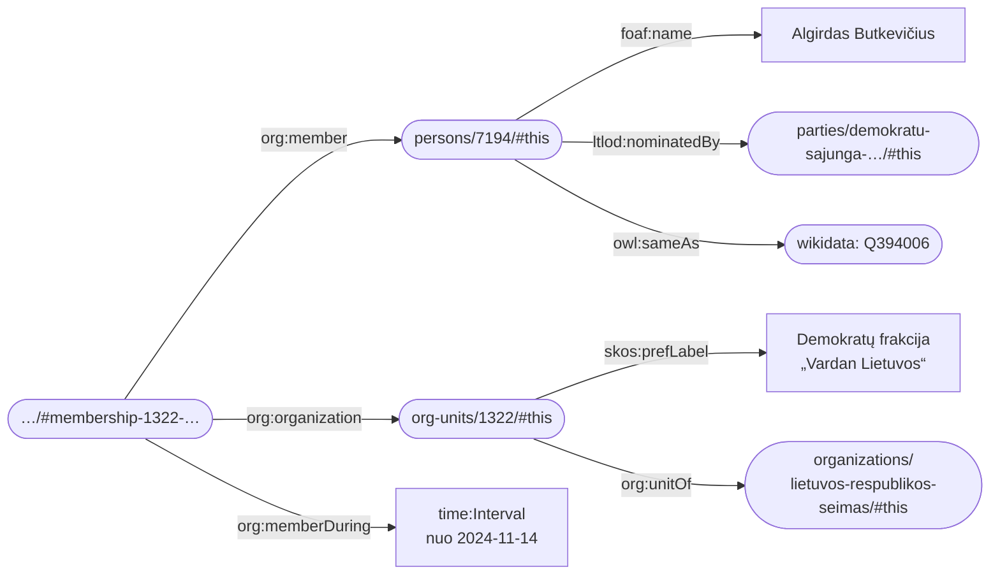
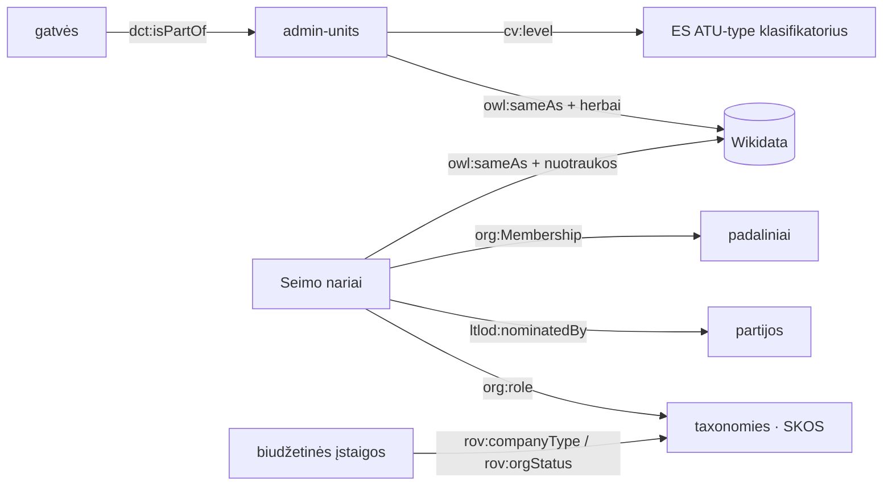
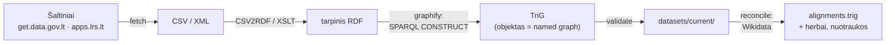

# LTLOD — Lietuvos susietieji atvirieji duomenys

LTLOD tikslas — **lietuviškas Knowledge Graph**: Lietuvos atvirieji duomenys, sujungti į vientisą,
standartais grįstą RDF grafą, kurį galima užklausti, papildyti ir susieti su pasauliniais
duomenimis (Wikidata, ES žodynais).

Šiame repozitoriuje yra:

- **atkuriamos (re-runnable) ETL grandinės** ([`etl/`](etl/)), kurios kiekvieno paleidimo metu
  parsisiunčia **aktualius** duomenis iš oficialių šaltinių ir sugeneruoja RDF rinkinius;
- **sugeneruoti duomenų rinkiniai** ([`datasets/current/`](datasets/current/)) — beveik milijonas
  RDF ketvertų apie administracinius vienetus, Seimo narius, įstaigas;
- **SPARQL užklausų pavyzdžiai** su rezultatais ([`etl/queries/EXAMPLES.md`](etl/queries/EXAMPLES.md)).

## RDF trumpai

[RDF](https://www.w3.org/TR/rdf11-primer/) — W3C standartas duomenims užrašyti **grafo** pavidalu.
Kiekvienas faktas yra trejetas *subjektas → predikatas → objektas*, o objektai identifikuojami
**URI adresais**, kurie galioja viso interneto mastu. Dėl to skirtingi rinkiniai susijungia
savaime — užtenka, kad jie naudotų tuos pačius URI.

Štai tikri duomenys iš šio repozitorijaus (Seimo narys, jo frakcija ir partija):



Narystė čia — atskiras objektas su galiojimo intervalu (`org:Membership` + `time:Interval`),
todėl grafas saugo ne tik dabartinę būseną, bet ir **istoriją**: pasikeitus pareigoms, sena
narystė gauna pabaigos datą, o nauja — pradžios.

Kiekvienas objektas gyvena savo **named graph'e** (dokumente), kurio URI sutampa su dokumento
adresu. Štai visas Birštono savivaldybės dokumentas ([TriG](https://www.w3.org/TR/trig/) sintakse):

```turtle
<https://linkeddata.lt/admin-units/12/> {
    <https://linkeddata.lt/admin-units/12/>
        dct:title "Birštono savivaldybė"@lt ;
        foaf:primaryTopic <https://linkeddata.lt/admin-units/12/#this> .

    <https://linkeddata.lt/admin-units/12/#this>
        a cv:AdminUnit ;                                        # ES Core Location klasė
        cv:level atu-type:LTU_SV ;                              # ES klasifikatorius: savivaldybė
        skos:prefLabel "Birštono savivaldybė"@lt ;
        skos:notation "12" ;                                    # natūralus raktas iš Adresų registro
        dct:isPartOf <https://linkeddata.lt/admin-units/2/#this> ;   # → Kauno apskritis
        owl:sameAs <http://www.wikidata.org/entity/Q2015893> ;  # → Wikidata
        schema:validFrom "1998-06-01"^^xsd:date .
}
```

Užklausoms naudojama [SPARQL](https://www.w3.org/TR/sparql11-overview/) — standartinė RDF užklausų
kalba (kaip SQL reliacinėms DB). Pavyzdžiai — [žemiau](#ką-jau-galima-atsakyti).

## Duomenų rinkiniai

| Rinkinys | Objektai | Šaltinis |
|---|---|---|
| [`admin-units`](datasets/current/admin-units/) | 10 apskričių, 60 savivaldybių, 584 seniūnijos, 26 229 gyvenamosios vietovės ir 61 149 gatvės (`streets`) | Adresų registras per [get.data.gov.lt](https://get.data.gov.lt/) |
| [`seimas`](datasets/current/seimas/) | 148 Seimo nariai su ~3 000 pareigų/narysčių (galiojimo intervalai), 137 padaliniai (frakcijos, komitetai, komisijos, parlamentinės grupės), 11 partijų | [apps.lrs.lt](https://www.lrs.lt/) XML API |
| [`legal-entities`](datasets/current/legal-entities/) | 6 025 valstybės ir savivaldybių biudžetinės įstaigos | JAR per get.data.gov.lt |
| [`taxonomies`](datasets/current/taxonomies/) | 8 SKOS klasifikatoriai: teisinės formos (iš JAR), statusai, pareigų/padalinių/vietovių/gatvių tipai | JAR + išvesta iš duomenų |

Rinkiniai tarpusavyje **susieti natūraliais raktais** (Adresų registro kodai, JAR kodai, Seimo
asmenų ID) — iš bet kurio išorinio rakto galima sukonstruoti objekto URI. Papildomai objektai
susieti su **Wikidata** (`owl:sameAs`) ir turi **atvaizdus**: savivaldybių herbus, Seimo narių
oficialius portretus (`foaf:depiction`).



URI schema ir raktų taisyklės: [`etl/URI-SCHEME.md`](etl/URI-SCHEME.md).

## Ontologijos ir žodynai

Principas: **pirmiausia W3C standartai → tada srities žodynai (ES SEMIC, OP klasifikatoriai, FOAF) → schema.org kaip platus bendrasis fallback'as → savi terminai tik kraštutiniu atveju.**

| Sritis | Žodynas |
|---|---|
| Administraciniai vienetai, adresai | [SEMIC Core Location 2.1.1](https://semiceu.github.io/Core-Location-Vocabulary/releases/2.1.1/) (`cv:AdminUnit`, `cv:level`) + ES [ATU-type](https://op.europa.eu/en/web/eu-vocabularies/dataset/-/resource?uri=http://publications.europa.eu/resource/dataset/atu-type) klasifikatorius (`LTU_APS`, `LTU_SV`, `LTU_SEN`…) |
| Juridiniai asmenys | [RegOrg / Core Business](https://www.w3.org/TR/vocab-regorg/) (`rov:RegisteredOrganization`, `rov:companyType`, `rov:orgStatus`) |
| Organizacijų struktūra, pareigos, narystės | W3C [ORG](https://www.w3.org/TR/vocab-org/) (`org:Membership`, `org:role`, `org:memberDuring`) + [W3C Time](https://www.w3.org/TR/owl-time/) intervalai — **be reifikacijos ir be RDF-star** |
| Asmenys | FOAF (+ suderinama su [Core Person 2.0](https://semiceu.github.io/Core-Person-Vocabulary/releases/2.00/)) |
| Klasifikatoriai | [SKOS](https://www.w3.org/TR/skos-primer/) |
| Savi terminai | vienintelis `ltlod:nominatedBy` (`http://linkeddata.lt/ns#`) — „iškėlusi partija“, kuriam ES/W3C atitikmens nėra |

Pasirinkimų motyvacija ir žinomos modeliavimo skolos: [`etl/ONTOLOGY-NOTES.md`](etl/ONTOLOGY-NOTES.md).

## Diegimas ir paleidimas

Reikalavimai:

- **Docker** — tik [`atomgraph/csv2rdf`](https://hub.docker.com/r/atomgraph/csv2rdf) konteineriui
  (CSV → RDF normalizacijai). `docker-compose` **nereikia** — jokios nuolat veikiančios
  infrastruktūros ETL nenaudoja.
- **Apache Jena** ([atsisiųsti](https://jena.apache.org/download/)) — `arq`/`riot` CLI
  transformacijoms ir validacijai (Jena 6 reikia Java 21+). Kelias nurodomas `JENA_HOME` arba
  [`etl/config.mk`](etl/config.mk).
- **`xsltproc`** — XML šaltinių (Seimo API) transformacijoms (macOS/Linux jau turi).
- **[`uv`](https://docs.astral.sh/uv/)** — Python įrankiams (Wikidata susiejimas, scraperiai);
  priklausomybes susitvarko pats.
- `make`, `curl`.

```shell
cd etl
make                                  # viskas: taxonomies → admin-units → seimas → legal-entities
make -C seimas all                    # tik vienas domenas
make -C seimas photos                 # papildomai: oficialūs portretai iš lrs.lt
make BASE=https://linkeddata.lt/      # produkcinė bazinė URI (numatytoji — https://localhost:4443/)
```

Kiekvienas rinkinys pereina tas pačias keturias stadijas, tad naujo šaltinio pridėjimas —
tik naujas katalogas su `fetch` + transformacijos užklausa:



Rezultatas visada atspindi šaltinių būseną paleidimo metu — jokių rankinių žingsnių.

## Publikavimas su LinkedDataHub

Rinkiniai publikuojami kaip naršomi Linked Data dokumentai per
[LinkedDataHub](https://github.com/AtomGraph/LinkedDataHub) (toliau — LDH). Reikia tik
Docker Desktop (Compose ≥ 2.23); visa infrastruktūra aprašyta `docker-compose.yml`
(tas pats išdėstymas kaip `linkeddatahub.com` / `Homepage` projektuose — nginx, LDH,
du Fuseki, Varnish kešai).

```shell
make up      # sugeneruoja slaptažodžius + serverio sertifikatą ir paleidžia LDH
make -C etl  # perkuria rinkinius su numatytąja baze https://localhost:4443/
make load    # užkrauna datasets/current/*/*.trig tiesiai į triplestore
```

Po `make up` LDH pasiekiamas adresu **<https://localhost:4443/>** (savo pasirašytas
sertifikatas — naršyklė įspės; pirmas paleidimas trunka ~1–2 min.). Administravimo
aplinka — <https://admin.localhost:4443/>.

**Svarbu dėl bazinės URI:** repozitorijoje užfiksuoti `datasets/current/` failai
sugeneruoti su produkcine baze `https://linkeddata.lt/`, tad prieš `make load` rinkinius
reikia perkurti su numatytąja lokalia baze (`make -C etl`) — kitaip dokumentų URI
nesutaps su LDH adresu ir jie nebus pasiekiami.

`make load` duomenis rašo **tiesiogiai į `fuseki-end-user` TDB2 saugyklą**
(`tdb2.tdbloader` per vienkartinį `tdb-loader` konteinerį) — ne po vieną dokumentą per
HTTP, kaip daro LDH CLI įrankiai: ~1 mln. ketvertų užsikrauna per kelias minutes.
Pabaigoje suteikiama vieša skaitymo prieiga (`make public` — LDH CLI `make-public.sh`
atitikmuo, vykdomas tiesiogiai per `fuseki-admin` konteinerių tinkle).
Triplestore prievadai **neatveriami į host'ą** — SPARQL užklausos teikiamos per LDH:
<https://localhost:4443/sparql>. Krovimas yra *append-only*: pakartotinis `make load`
tik papildo saugyklą; švariam perkrovimui:

```shell
make down && rm -rf fuseki/end-user && make up && make load
```

Dokumento patikrinimas (Birštono savivaldybė):

```shell
curl -k -H "Accept: text/turtle" https://localhost:4443/admin-units/12/
```

Pastabos:

- `make drop` ištrina tik LDH vykdymo būseną (`fuseki/`, `ssl/`, `secrets/`, `uploads/`,
  `datasets/owner`, `datasets/secretary`) — `datasets/current/` niekada neliečiamas.
- Prievadai 81/4443/5443 sutampa su kitų lokalių LDH diegimų (pvz., `LinkedDataHub`
  repozitorijos) prievadais — vienu metu gali veikti tik vienas stack'as.
- Dokumentai naršomi per LDH konteinerius: kiekvienas dokumentas yra `dh:Item` su
  `sioc:has_container`, o patys konteineriai (`datasets/current/containers/`) —
  `dh:Container` dokumentai (pvz., <https://localhost:4443/admin-units/>).

## Ką jau galima atsakyti?

Visi rinkiniai užkraunami į atmintį viena komanda ir užklausiami SPARQL'u:

```shell
etl/queries/run.sh <užklausa.rq>
```

Pavyzdys: **kas šiuo metu vadovauja Seimo komitetams ir komisijoms, kuri partija juos iškėlė,
nuo kada — ir kaip jie atrodo?** Viena užklausa kerta šešis failus: asmenis, padalinius,
pareigų taksonomiją, partijas, nuotraukas ir Wikidata susiejimus. Narystės su galiojimo
intervalais leidžia klausti „kas vadovauja **dabar**“ — imamos tik narystės be pabaigos datos:

```sparql
PREFIX foaf:  <http://xmlns.com/foaf/0.1/>
PREFIX org:   <http://www.w3.org/ns/org#>
PREFIX skos:  <http://www.w3.org/2004/02/skos/core#>
PREFIX time:  <http://www.w3.org/2006/time#>
PREFIX ltlod: <http://linkeddata.lt/ns#>

SELECT ?unit ?chair ?party ?since ?photo
FROM <urn:x-arq:UnionGraph>
WHERE
{
    ?membership a org:Membership ;
        org:member ?person ;
        org:organization ?org ;
        org:role ?roleConcept ;
        org:memberDuring ?interval .
    FILTER NOT EXISTS { ?interval time:hasEnd ?end }
    OPTIONAL { ?interval time:hasBeginning/time:inXSDDate ?since }

    ?roleConcept skos:prefLabel ?role .
    FILTER(LANG(?role) = "lt" && CONTAINS(LCASE(STR(?role)), "pirminink"))
    FILTER(!CONTAINS(LCASE(STR(?role)), "pavaduotoj"))

    ?org skos:prefLabel ?unit .
    ?person foaf:name ?chair .
    OPTIONAL { ?person ltlod:nominatedBy/skos:prefLabel ?party }
    OPTIONAL { ?person foaf:depiction ?photo . FILTER(CONTAINS(STR(?photo), "lrs.lt")) }
}
ORDER BY ?unit
```

| Padalinys | Pirmininkas | Iškėlusi partija | Nuo | |
|---|---|---|---|---|
| Antikorupcijos komisija | Arvydas Anušauskas | Tėvynės sąjunga-Lietuvos krikščionys demokratai | 2024-12-05 |  |
| Aplinkos apsaugos komitetas | Linas Jonauskas | Lietuvos socialdemokratų partija | 2024-11-21 |  |
| Ateities komitetas | Vytautas Grubliauskas | Lietuvos socialdemokratų partija | 2024-11-21 |  |
| Audito komitetas | Artūras Zuokas | Partija „Laisvė ir teisingumas“ | 2026-07-15 |  |
| Europos reikalų komitetas | Rasa Budbergytė | Lietuvos socialdemokratų partija | 2024-11-21 |  |

Daugiau klausimų, į kuriuos duomenys jau atsako (visi su užklausomis ir pilnais rezultatais
[`etl/queries/EXAMPLES.md`](etl/queries/EXAMPLES.md)):

- kurios savivaldybės turi daugiausia gyvenamųjų vietovių ir kaip atrodo jų herbai;
- kur tiksliai yra bet kuri gatvė (gatvė → vietovė → savivaldybė → apskritis);
- dabartinė Seimo frakcijų sudėtis su iškėlusiomis partijomis ir nuotraukomis;
- kiek biudžetinių įstaigų veikia, o kiek išregistruota, pagal teisines formas;
- kokia dalis objektų jau susieta su Wikidata (`CONSTRUCT` pavyzdys papildomai parodo,
  kaip iš grafo sugeneruoti schema.org profilius kitoms sistemoms).

## Ateities darbai

**Publikavimas.** Lokalus LinkedDataHub diegimas jau yra — žr.
[Publikavimas su LinkedDataHub](#publikavimas-su-linkeddatahub). Lieka produkcinis
diegimas `https://linkeddata.lt/` adresu (rinkiniai jau generuojami su `$base`
parametrizuotomis URI, tad tereikia `make -C etl BASE=https://linkeddata.lt/`).

**Nauji rinkiniai** (integracijos taškai jau paruošti — žr. „kaip pridėti“ žemiau):

- Adresų registro **adresai ir koordinatės** (~1 mln.; `locn:Address` + GeoSPARQL geometrijos),
  tada JAR **buveinės** susietų įstaigas su konkrečiais adresais;
- **pilnas JAR** (~540 tūkst. juridinių asmenų — dabar tik biudžetinės įstaigos);
- **VRK rinkimų duomenys** (kandidatai, rezultatai) — atnaujintų 2012 m. archyvą;
- **viešieji pirkimai** su ES [ePO](https://docs.ted.europa.eu/epo-home/index.html) ontologija;
- švietimo įstaigos, interesų deklaracijos (reikės savo žodyno).

**Žodynų plėtra:** tiesioginiai `skos:exactMatch` į [NUTS](http://data.europa.eu/nuts/code/LT021)/LAU;
Core Person terminai atsiradus asmenų gimimo datoms; belyčiai pareigų konceptai
(dabar „pirmininkas“/„pirmininkė“ — atskiri konceptai, kaip šaltinyje).

**Kaip pridėti naują rinkinį:** sukurti `etl/<domenas>/` su `Makefile`, `fetch` žingsniu ir
LDH stiliaus `mappings/*.rq` (žr. [`etl/admin-units/`](etl/admin-units/) kaip šabloną);
papildyti [`etl/URI-SCHEME.md`](etl/URI-SCHEME.md) konteineriu ir natūralaus rakto taisykle;
jei objektai turi atitikmenis Wikidata — pridėti domeną į
[`etl/tools/src/ltlod_etl/reconcile.py`](etl/tools/src/ltlod_etl/reconcile.py).
Žodynams galioja kaskada ES → W3C → savas (`http://linkeddata.lt/ns#`).

## Duomenų aktualumas ir patikimumas

`datasets/current/` atspindi šaltinių būseną **paskutinio ETL paleidimo metu** — kada tai buvo,
matyti tų failų git istorijoje; `make` visada sugeneruoja šviežią versiją.

Tai **išvestinis, neoficialus** rinkinys: autoritetingi šaltiniai lieka valstybės registrai ir
Seimo kanceliarija. Wikidata susiejimai daromi automatiškai (deterministinės atitiktys pagal
kodus ir etiketes) — nesusieti objektai fiksuojami peržiūros ataskaitose (`etl/*/cache/unmatched*.csv`),
tačiau pavienės klaidingos atitiktys galimos. Radę klaidą — praneškite per GitHub issues.

## Licencija

- **Kodas** (ETL, užklausos, įrankiai) — [Apache-2.0](LICENSE).
- **Sugeneruoti duomenys** (`datasets/current/`) — [CC BY 4.0](https://creativecommons.org/licenses/by/4.0/deed.lt),
  kaip ir šaltiniai: Adresų registro ir JAR duomenys © [Registrų centras](https://www.registrucentras.lt/) /
  Valstybės duomenų agentūra per [get.data.gov.lt](https://get.data.gov.lt/) (CC BY 4.0),
  Seimo duomenys © [Seimo kanceliarija](https://www.lrs.lt/) (CC BY 4.0), susiejimai su
  [Wikidata](https://www.wikidata.org/) (CC0). Naudodami duomenis nurodykite šiuos šaltinius.
- Seimo narių portretai **neplatinami** šiame repozitorijuje — duomenyse tik nuorodos
  (`foaf:depiction`) į lrs.lt ir Wikimedia Commons originalus.

---

Klausimai, idėjos, klaidos, nauji duomenų šaltiniai — laukiami per GitHub issues ir pull
requests (žr. „Kaip pridėti naują rinkinį“) arba [martynas@atomgraph.com](mailto:martynas@atomgraph.com).
